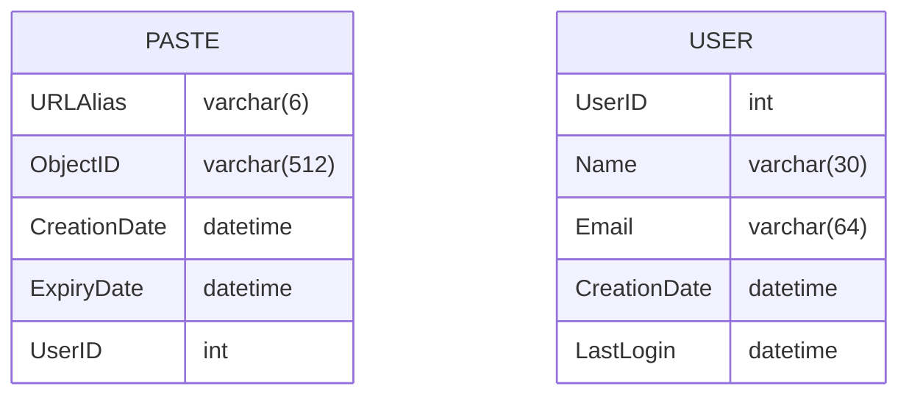
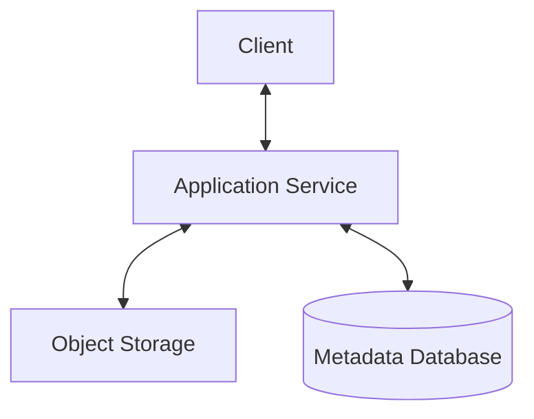
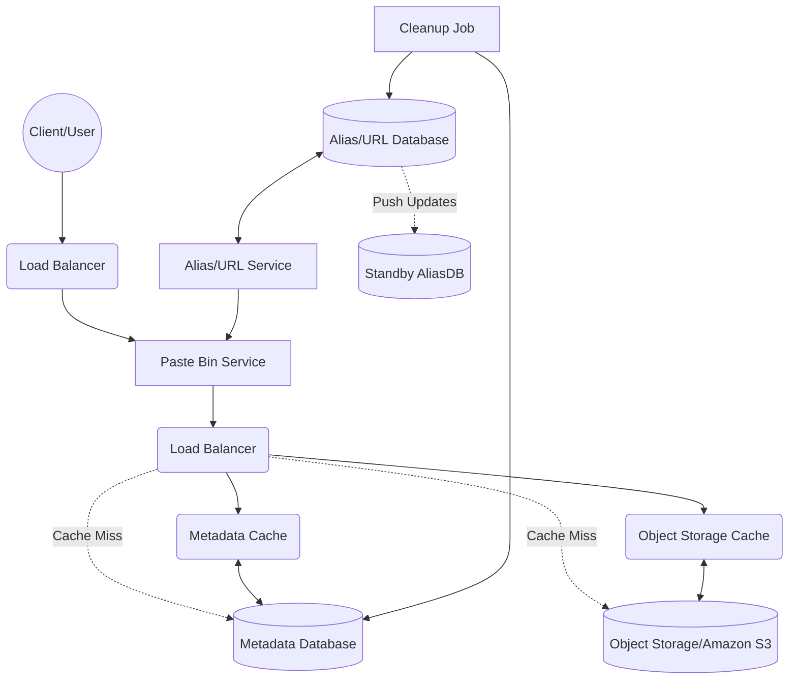

# Desiging Pastebin

> [!NOTE]
> Aliases and generated URLS/Links are interchangeable terms.

#### Functional requirements
1. Users can paste/upload data (only text)
2. Users can access data from generated URLs
3. Data and links will expire after some time
4. Users can specify custom aliases for URLs (Optional)

#### Non-functional requirements
1. The system should be highly reliable (Data should not be lost)
2. 1. The system should be highly available
> [!NOTE]
> The system should be fault-tolerant. We can use multiple instances of app servers, such as by sharding the database and replications.

3. The system should have minimal latency
> [!NOTE]
> 1. We should consider using a cache to reduce round trips to the database.
> 2. Storing all possible aliases beforehand can save the server time rather than generating them on the fly to squeeze out the best performance from the servers. It can also ensure we refrain from re-generating the same aliases.
> 3. If we use in-memory caching, then calculating memory estimation is an excellent requirement.

4. Generated URLs must not be predictable
> [!NOTE]
> Simple hashing + encoding can result in predictable aliases. Pre-generating aliases beforehand and randomly assigning them on the fly can make aliases unpredictable

#### Extended requirements
1. Analytics
2. Exposing REST APIs to third-party services

## Capacity Estimation & Constraints
1. Read heavy application - 5:1 ratio
2. 1M new URLs per day (user requirement)
3. Records saved for 10 years by default
4. 10MB maximum and 10KB average paste size (ballpark estimation)
5. 80-20 rule for caching
> [!TIP]
> 80% of the traffic will be generated by 20% of records

| Statistic | Description | Calculation | Value |
| --- | --- | --- | --- |
| New Pastes | Write Queries per second | `1M / (24 hours * 3600)` | ~12/s |
| Get Pastes | Read Queries per second | `5 * New Pastes` | ~58/s |
| Incoming data | Write bandwidth | `10KB * New Pastes` | 120KB/s |
| Outgoing data | Read bandwidth | `5 * Incoming data` | 0.6MB/s |
| Total Pastes | Total records for 10 years | `1M * 30 days * 12 months * 10 years` | 3.6B |
| Storage | Total storage requirements for 10 years | `10KB * Total Pastes` | 36TB |
| Memory estimation | In-memory usage per day for caching | `0.2 (80-20 rule) * Read QPS * 3600 * 24 * 10KB` | ~10GB/day |

> [!TIP]
> Let's ensure that we keep the database utilization to 70%, which means the total storage requirement will be ~51.4TB (36TB / 0.7).

## System APIs

```python
def add_paste(api_key: str, paste_data: str,
              alias: Optional[str], expiry_date: Optional[date]) -> str:
  """
  api_key -- Identify user & throttle access based on quota
  paste_data -- Text data
  alias -- Requested alias to use for new pastes or add new paste item to existing URL
  expiry_date -- Date on which the URL and data will expire
  """
  pass

def get_paste(api_key: str, paste_id: str) -> str:
  """
  api_key -- Identify user & throttle access based on quota
  paste_id -- Get paste data of the associated paste_id
  """
  pass

def delete_paste(api_key: str, paste_id: str) -> bool:
  """
  api_key -- Identify user & throttle access based on quota
  paste_id -- Delete paste data of the associated paste_id
  """
  pass
```

## Database Design
1. We need to store billions of records
2. Each metadata record is ~100 bytes (reasonably small)
3. Each pasted data (object) is ~10KB (average)
4. No reasonable requirement for using relationships
5. Should support read-heavy application

> [!NOTE]
> Use a NoSQL database for the metadata for the following reasons -
> 1. Need to store billions of records
> 2. Read-heavy application
> 3. Supports horizontal scaling and replication for the "highly available" non-functional requirement
>
> A wide-column database like Cassandra is a good choice since we have a tuple-like schema for URLs and Users. We can also use key-value stores like DynamoDB.
> To store pasted data, we can use object storage solutions like Amazon S3 and scale it separately.



## High-level Design



> [!IMPORTANT]
> Please check the URL Shortening Service's [README](../url-shortening-service/README.md) for the following sections.
> 1. The use of Alias Service to generate and assign custom aliases to access the pastes.
> 2. How to partition and replicate data using range-based and hash-based partitioning.
> 3. How to cache frequently accessed pastes.
> 4. Load Balancers -- round robin vs intelligent and where to place them.
> 5. Cleaning up old paste data and URLs from the database.


