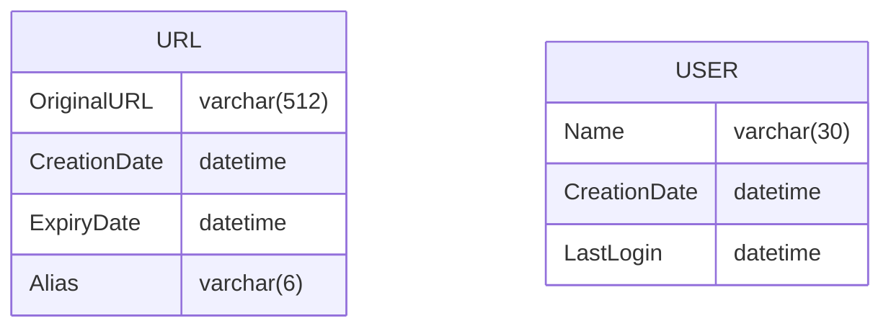
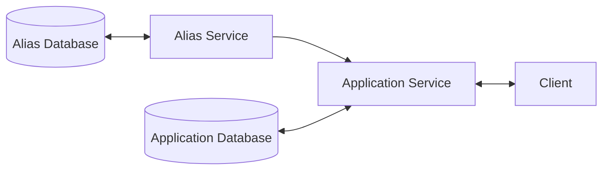
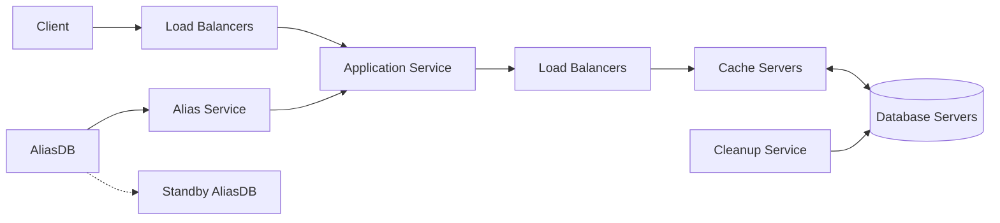

# Desiging a URL Shortening service like TinyURL

#### Functional requirements
1. Generate a shorter and unique alias for URLs
2. Redirect shortened URLs to the original URLs
3. Users can create custom alias for URLs (Optional)
4. Links will expire after some time

#### Non-functional requirements
1. The system should be highly available
> [!NOTE]
> The system should be fault-tolerant. We can use multiple instances of app servers, such as by sharding the database and replications.

2. The system should have minimal latency
> [!NOTE]
> 1. We should consider using a cache to reduce round trips to the database.
> 2. Storing all possible aliases beforehand can save the server time rather than generating them on the fly to squeeze out the best performance from the servers. It can also ensure we refrain from re-generating the same aliases.
> 3. If we use in-memory caching, then calculating memory estimation is an excellent requirement.

3. Shortened URLs must not be predictable
> [!NOTE]
> Simple hashing + encoding can result in predictable aliases. Pre-generating aliases beforehand and randomly assigning them on the fly can make aliases unpredictable

#### Extended requirements
1. Analytics
2. Exposing REST APIs to third-party services

## Capacity Estimation & Constraints
1. Read heavy application - 100:1 ratio
2. 500M new URLs per month (user requirement)
3. Records saved for five years by default
4. 500 bytes per record (ballpark estimation)
5. 80-20 rule for caching
> [!TIP]
> 80% of the traffic will be generated by 20% of records

| Statestic | Description | Calculation | Value |
| --- | --- | --- | --- |
| New URLs | Write Queries per second | `500M / (30 days * 24 hours * 3600)` | ~200/s |
| URL redirections | Read Queries per second | `100 * New URLs` | ~20K/s |
| Incoming data | Write bandwidth | `500 * New URLs` | 100KB/s |
| Outgoing data | Read bandwidth | `100 * Incoming data` | 10MB/s |
| Storage | Total storage requirements for 5 years | `500 bytes * 500M * 12 months * 5 years` | 15TB |
| Memory estimation | In-memory usage per day for caching | `0.2 (80-20 rule) * Read QPS * 3600 * 24 * 500 bytes` | ~170GB/day |

## System APIs

```python
def create_url(api_key: str, original_url: str,
               custom_alias: Optional[str], expiry_date: Optional[date]) -> str:
  """
  api_key -- Identify user & throttle access based on quota
  original_url -- Requested URL to shorten
  custom_alias -- Requested alias to use
  expiry_date -- Date on which the URL will expire
  """
  pass

def delete_url(api_key: str, url_alias: str) -> bool:
  """
  api_key -- Check whether the user has access to delete the requested alias
  url_alias -- Alias to delete
  """
  pass
```

## Database Design
1. We need to store billions of records
2. Each record is 500 bytes (reasonably small)
3. No reasonable requirement for using relationships
4. Should support read-heavy application

> [!NOTE]
> Use a NoSQL database for this use case for the following reasons -
> 1. Need to store billions of records
> 2. Read-heavy application
> 3. Supports horizontal scaling and replication for the "highly available" non-functional requirement
>
> A wide-column database like Cassandra is a good choice since we have a tuple-like schema for URLs and Users. We can also use key-value stores like DynamoDB.



## Algorithm
1. The basic approach would be to use MD5 or SHA256 to hash the original URLs and then encode them using base32, base62, or base64 algorithms
2. If we choose base64 encoding, we can take the first 6 or 8 characters to generate the alias
> [!NOTE]
> There can be about ~68.7B (64^6) unique aliases we can generate using base64, which suffices the requirement since max records can be 50B based on requirements.

#### Potential Issues
1. Users requesting shortening for the duplicate URLs will get the same aliases

#### Workarounds
1. Hash the user's identifier with the original URL to generate different aliases
2. Append sequence value with the original URL to generate different aliases
3. Generate all possible ~68.7B possible aliases and randomly assign one to the URL
> [!TIP]
> Workaround #3 addresses the "not predictable" non-functional requirement since we will be randomly assigning aliases to the requested URL. This approach will also help assign URLs to aliases faster since we don't need to generate aliases on the fly and prevent generating duplicate aliases for the same URLs.

## Design

#### Alias Service
1. We can generate all possible ~68.7B records offline and store them in a database called AliasDB
2. To address concurrency issues, we can create two tables, one for storing unused and one for using aliases
3. We can load some keys in the memory for fast performance. Once loaded, we mark these aliases as "used" and move them to the used table to avoid the same aliases reserved by different instances of Alias Service.

> [!NOTE]
> Loading unused aliases in the memory can cause a potential issue. If any of Alias Service's instances die, we will lose the unused cached aliases. This scenario is acceptable since we generate significantly more offline aliases than the total URLs.

4. The total size required for the AliasDB will be `6 characters * ~68.7B records = ~412GB`
5. Since Alias Service will be a single point of failure, we will create standby replicas of it



#### Data partition and replication
We can partition the data in two ways - 
1. Range-based partition - Using the first letter of the alias to partition the database.
> [!NOTE]
> This approach could lead to uneven distribution of the clusters.

2. Hash-based partition - Using the hash & modulo method to partition aliases.
> [!NOTE]
> We can use consistent hashing to allow database scaling requirements.

#### Cache
1. We can use Redis or Memcache to cache the frequently used URLs
2. We can use the LRU algorithm to ensure most frequently used URLs are cached

#### Load Balancer
1. We can place load balancers between Client and Application Servers, Application Servers and Databases, and Application Servers and Cache Servers.
2. We can use Round Robin or an intelligent way to adjust load based on traffic.

#### Purging & DB Cleanup
1. We can lazily clean the URLs if a user tries to access the shortened after it has expired
2. We can introduce a Cleanup Service that periodically cleans up expired links and frees the used aliases
> [!NOTE]
> We might have some URLs not accessed even after six months. We can keep them until they expire since storage is cheap.


